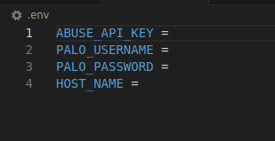

# Palo Alto Python API 

Python script for automating operations on Palo Alto firewalls using the PanOS API and requests library

## Installation

Use the below command

```bash
pip install -R REQUIREMENTS.txt
```

## Usage

```python
python main.py
```

### .env file structure



## Contributing

Pull requests are welcome. For major changes, please open an issue first
to discuss what you would like to change.

Please make sure to update tests as appropriate.

## License

[MIT](https://choosealicense.com/licenses/mit/)

## Blog post

[Medium Post](https://medium.com/@itsprathap/automating-cyber-defense-unleash-pythons-power-for-effortless-firewall-management-0b743e2e083f)

## TODO  

- [x] Interface the script  
